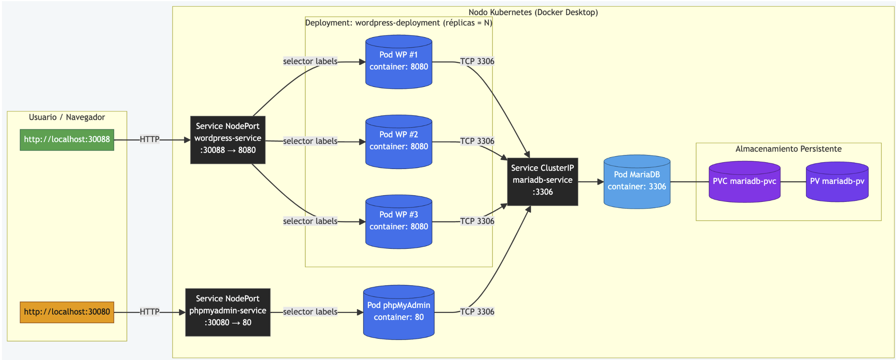

# Evaluación Parcial N°1 - Orquestación de Contenedores con Kubernetes

**Asignatura:** INY1106 - Infraestructura de Aplicaciones II  
**Tiempo Asignado:** 5 horas pedagógicas  
**Ponderación:** 30% de la nota final  
**Modalidad:** Ejecución práctica individual

## Objetivo General

Implementar una infraestructura para microservicios usando tecnología de orquestación de contenedores Kubernetes, verificando la capacidad para configurar, desplegar y gestionar una infraestructura para microservicios en un entorno local y de nube pública.

## Indicadores de Logro a Evaluar

- **IL1.1:** Despliega una infraestructura basada en microservicios utilizando Kubernetes, en función de los requisitos de escalabilidad y mantenimiento de la organización.
- **IL1.2:** Optimiza el rendimiento de una infraestructura de microservicios utilizando herramientas de gestión, demostrando la capacidad de mejorar la eficiencia operativa en un entorno de producción.
- **IL1.3:** Implementa soluciones para mitigar los desafíos de seguridad inherentes a la arquitectura de microservicios, considerando la sensibilidad de los datos.

## Arquitectura a Implementar

La solución debe incluir los siguientes componentes:

- **WordPress** con 2 réplicas escalables
- **MariaDB** con almacenamiento persistente
- **phpMyAdmin** para administración de base de datos
##  Diagrama de implementación

### Especificaciones de Servicios

- **wordpress-service:** NodePort 30088 → Pods WordPress (puerto contenedor 8080)
- **phpmyadmin-service:** NodePort 30080 → Pod phpMyAdmin (puerto 80)
- **mariadb-service:** ClusterIP accesible solo dentro del clúster (puerto 3306)

## Etapas de Implementación

### 1. Configuración y Despliegue del Clúster de Kubernetes

#### Prerrequisitos
- Instalar `kubectl` en la máquina local
- Instalar CLI específico del proveedor de nube (aws-cli, gcloud, az-cli). En caso de ser una implementación cloud

#### Creación del Clúster
- Utilizar servicios gestionados (Amazon EKS, Google GKE, Azure AKS) o Docker Desktop
- Configurar cantidad de nodos, autoescalamiento, tipo de instancia y región (si es cloud)
- Verificar conexión mediante `kubectl`

#### Configuración de Redes y Seguridad (Solo para Cloud)
- Configurar redes del clúster con rangos IP y subredes (mínimo X.X.X.X/20)
- Implementar Network Policies para control de tráfico
- Configurar Security Groups/Firewalls/NSG para protección de nodos
- Establecer autenticación y autorización RBAC

#### Despliegue de Manifiestos
- **Deployment:** 2 réplicas, imagen del contenedor, políticas de actualización, recursos de cómputo y memoria
- **Service:** Configurar ClusterIP, NodePort o LoadBalancer según corresponda
- **Ingress:** (Si aplica) Configurar para exposición HTTP/HTTPS con cifrado en tránsito

#### Balanceadores de Carga
- Implementar balanceador para distribuir tráfico entre réplicas

### 2. Configuración de Volúmenes Persistentes

- **PersistentVolume (PV):** Conectar con servicios de almacenamiento del proveedor
- **PersistentVolumeClaim (PVC):** Solicitar almacenamiento al PV
- **Modificación de Deployments:** Montar volúmenes en rutas especificadas

### 3. Escalabilidad Horizontal y Vertical

#### Escalado Horizontal
- Ajustar manualmente el número de réplicas de los pods en el Deployment para simular un cambio en la carga de trabajo.

#### Escalado Vertical
- Ajusta los recursos asignados a los contenedores (CPU y memoria) mediante la modificación de los límites y solicitudes en el manifiesto del Deployment.

## Materiales e Insumos

- Conectividad a Internet
- Acceso a nube pública (opcional)
- Contenedores Docker públicos
- Contenedores Bitnami (MariaDB y WordPress)

## Entregables

1. **Documento paso a paso** en formato PDF o enlace a Wiki de acceso público
2. **Archivos YAML** para reproducir el despliegue realizado

## Rúbrica de Evaluación

### Criterios de Desempeño

| Nivel                    | Porcentaje | Descripción                                                                                                                                                                                       |
|--------------------------|------------|---------------------------------------------------------------------------------------------------------------------------------------------------------------------------------------------------|
| **Muy buen desempeño**   | 100%       | Demuestra un desempeño destacado, evidenciando el logro de todos los aspectos evaluados en el indicador.                                                                                          |
| **Buen desempeño**       | 80%        | Alto Demuestra un alto desempeño del indicador, presentando pequeñas omisiones, dificultades y/o errores.                                                                                         |
| **Desempeño aceptable**  | 60%        | Demuestra un desempeño competente, evidenciando el logro de los elementos básicos del indicador, pero con omisiones, dificultades o errores.                                                      |
| **Desempeño incipiente** | 30%        | Presenta importantes omisiones, dificultades o errores en el desempeño, que no permiten evidenciar los elementos básicos del logro del indicador, por lo que no puede ser considerado competente. |
| **Desempeño no logrado** | 0%         | Presenta ausencia o incorrecto desempeño.                                                                                                                                                         |

### Pauta de evaluación

| Indicador de Evaluación                                                                                                                                      | Muy buen desempeño 100%                                                                                                                                          | Buen desempeño 80%                                                                                                                                               | Desempeño aceptable 60%                                                                                                  | Desempeño incipiente 30%                                                                                                                          | Desempeño no logrado 0%                                             | Ponderación indicador de evaluación |
--------------------------------------------------------------------------------------------------------------------------------------------------------------|------------------------------------------------------------------------------------------------------------------------------------------------------------------|------------------------------------------------------------------------------------------------------------------------------------------------------------------|--------------------------------------------------------------------------------------------------------------------------|---------------------------------------------------------------------------------------------------------------------------------------------------|---------------------------------------------------------------------|-------------------------------------|
| IE1.1 Despliega el clúster de Kubernetes en función de la configuración de los requisitos de escalabilidad y mantenimiento de la organización.               | Clúster de Kubernetes desplegado correctamente, especificando redes y la cantidad de nodos, manteniendo alta disponibilidad y región                             | Clúster desplegado con instalación y configuración de redes y seguridad completas, aunque con ajustes menores en roles RBAC.                                     | Clúster creado y configurado con errores menores en redes o configuración de seguridad.                                  | Clúster desplegado con errores en los procesos de conexión y/o configuración de seguridad incompleta.                                             | No se realizó la configuración del clúster.                         | 20%                                 |
| IE1.3.1 Implementa controles de acceso, autenticación y cifrado en la arquitectura de microservicios                                                         | Implementa controles de acceso correctamente, en base a las redes y políticas de seguridad configuradas y roles RBAC funcionales y detallados.                   | Implementa controles de acceso en base a la configuración de redes y ajustes menores en roles RBAC.                                                              | Implementa controles de acceso en base a la configuración de redes y seguridad básicas, y ajustes menores en roles RBAC. | Implementa controles de acceso en base a la configuración de redes y seguridad básicas, y ajustes menores en roles RBAC, pero con errores graves. | No implementa controles de acceso, autenticación en la arquitectura | 10%                                 |
| IE1.1.2 Empaqueta aplicaciones para Kubernetes en función de los requisitos de mantenimiento de la organización.                                             | Aplicación empaquetada y desplegada correctamente, manifiestos YAML completos y balanceadores de carga configurados y operativos.                                | Aplicación desplegada con manifiestos bien configurados y balanceador funcional, con mínimos errores en configuración.                                           | Despliegue realizado con manifiestos incompletos o errores en la configuración de balanceadores.                         | Aplicación empaquetada con graves errores en los manifiestos y balanceador configurado incorrectamente.                                           | No se realizó el empaquetado ni el despliegue de la aplicación      | 40%                                 |
| IE1.1.3 Implementa Volúmenes Persistentes en función de la configuración de los requisitos de escalabilidad y mantenimiento de la organización               | Volúmenes configurados correctamente, con PersistentVolume y PersistentVolumeClaim funcionales y manifiestos modificados correctamente para el uso de volúmenes. | Volúmenes configurados correctamente, con PersistentVolume y PersistentVolumeClaim funcionales y manifiestos modificados correctamente para el uso de volúmenes. | Volúmenes persistentes configurados y en uso, con errores menores en la vinculación con los manifiestos.                 | Volúmenes persistentes configurados y en uso, con errores de vinculación o falta de configuración adecuada.                                       | No se configuraron volúmenes persistentes.                          | 10%                                 |
| IE1.1.4 Implementa la escalabilidad vertical de aplicaciones en Kubernetes en función de los requisitos de escalabilidad y mantenimiento de la organización. | Escalabilidad funcional con ajuste manual de réplicas y recursos y HPA configurado con métricas estándar, funcionando correctamente.                             | Escalabilidad funcional con ajuste manual de réplicas y recursos y HPA configurado con métricas estándar, funcionando correctamente.                             | Escalabilidad configurada, pero con errores en el ajuste de recursos o funcionamiento del HPA.                           | Escalabilidad configurada parcialmente, con ajuste de réplicas sin verificar comportamiento.                                                      | No se configuró la escalabilidad de las aplicaciones                | 20%                                 |